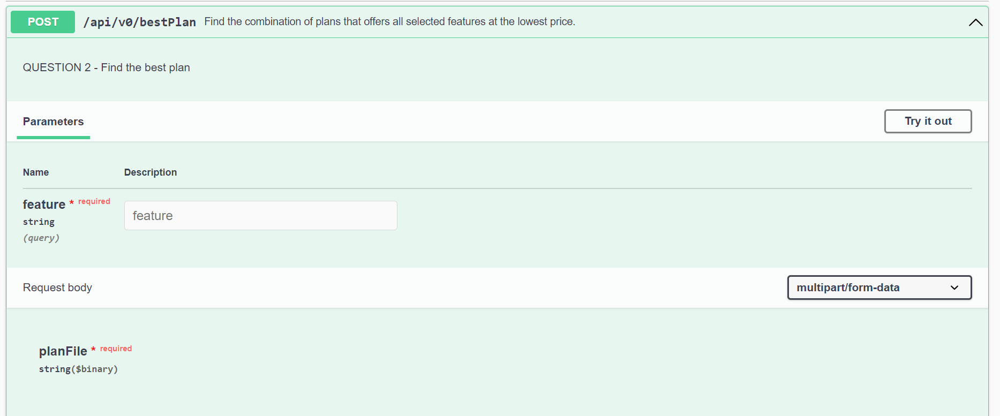
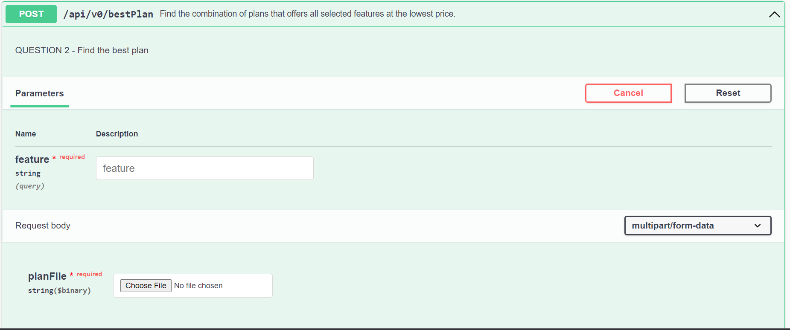
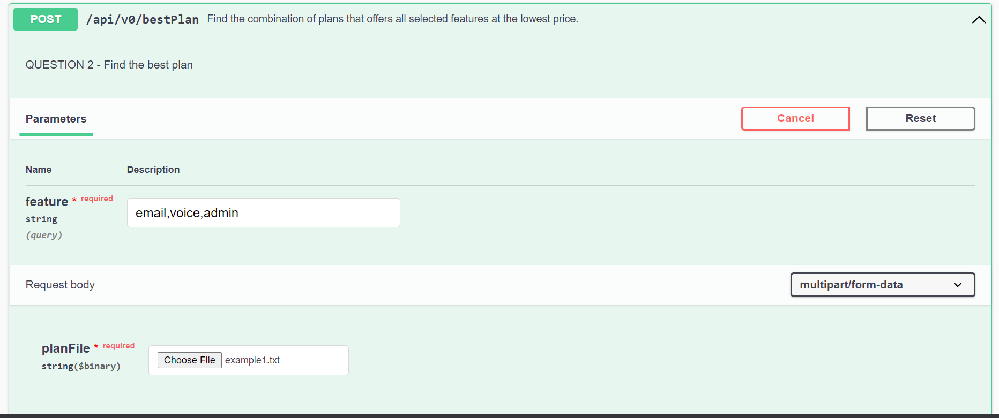
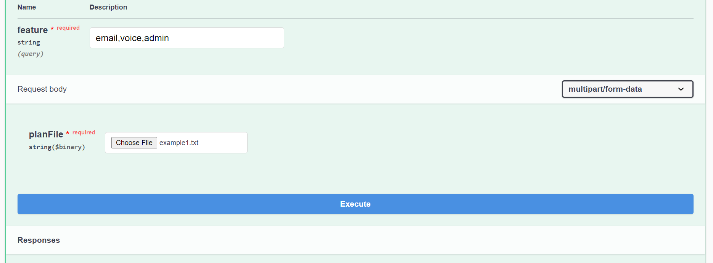
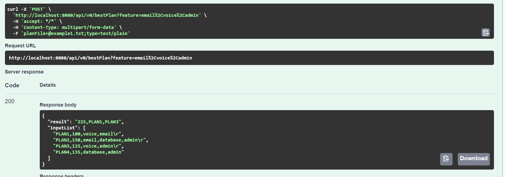

# Find the best plan

Finds the combination of plans that offers all selected features at the lowest price.

## Build

Use `mvn compile` for building.

## Run
* Use `mvn spring-boot:run` to run the application.

## How to test RESTFUL API
* Open web browser try url http://localhost:8080/swagger-ui.html
* Click on Down arrow
* 
* Click on 'Try it out'
* 
* Choose file
* 
* Enter features
* 
* See the result
* 

## Linting

Formatting should follow Google Java Format. It will be enforced during `verify` phase of maven. To
fix reported issues `mvn spotless:apply` can be used.

## Tests

`mvn test` should run unit tests. Tests that are not at component/class level i.e. requiring Spring
container are suffixed with `IT` and are run via `mvn integration-test`.

## Coverage

Unit test coverage using Jacoco can be run via `mvn clean test jacoco:report` and report will be
generated in `target/site/jacoco/index.html`. For integration tests
run `mvn clean test-compile failsafe:integration-test jacoco:report`.

**Note:** If you want to exclude a class from test report, please add the exclusion in the pom.xml
for JacocoReport and also add the exclusion to `sonarCoverageExclusions` in the Jenkinsfile.

## Run
`mvn spring-boot:run `

## How to create docker image
* Creating docker image
`mvn install`
`docker build -t debgtjb/bestplan .`
`docker run -p 8080:8080 debgtjb/bestplan`

## docker image location
[Docker image](https://hub.docker.com/r/debgtjb/bestplan 'best plan')

#### [Wiki Page](https://github.com/debmalya/odysses/wiki "Wiki Page") added
